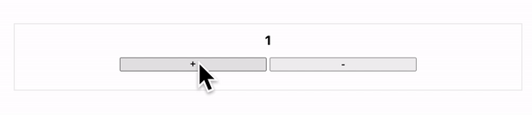
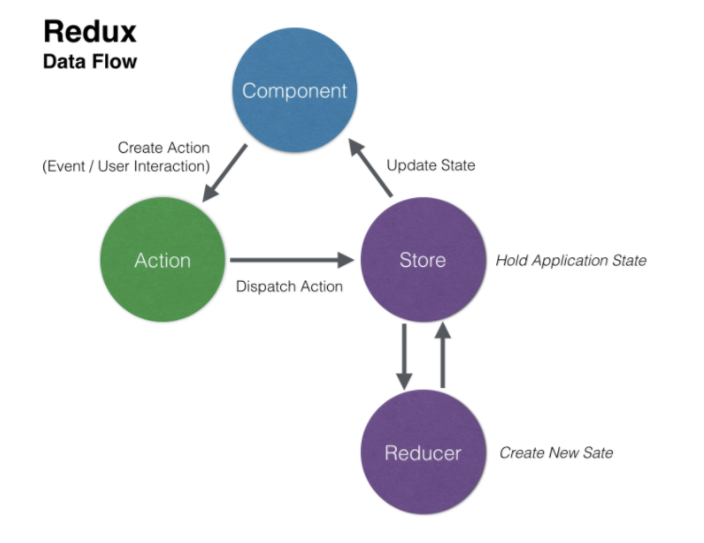
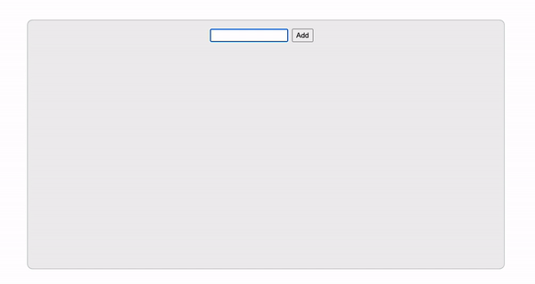

# Redux101

> Learn vanilla redux and react-redux

<details>
<summary style="font-size : 18px">Log</summary>
</details>

<br />

## Vanilla Redux with Counter

> 카운터를 만들면서 바닐라 리덕스 알아보기 1탼

> branch `vanilla-redux-counter`



### Basic Redux

리덕스에서 반드시 알아야 할 세가지는 **저장소(store), 리듀서(reducer), 액션(action)** 이다.

#### Store

```js
import { createStore } from 'redux';

const reducer = (previousState, action) => newState;

const store = createStore(reducer);
```

저장소는 앱의 상태를 저장하는 공간이다. 리덕스 앱에서는 단 한개의 저장소만을 가질 수 있다. 이 저장소는 4가지의 메소드를 가지고 있다. (그 중 여기선 3가지만을 공부할 예정이다.)

메소드에 대해서 알아보면, 자연스럽게 개념을 이해하게 될 것이다.

- `getState()`는 저장소에서 현재 앱의 상태를 가져올 수 있다.
- `dispatch(action)`는 앱에서 상태 변경에 대한 메세지(액션)를 저장소에 보낼 때 사용한다.
- `subscribe(listener)`는 리스너을 통해서 앱을 등록하여 상태 변경을 감지하여 리랜더링이 되도록 한다.

`createStore` 메소드에 첫번째 인자로서 리듀서를 넣어주면서 저장소를 생성할 수 있다.

#### Reducer

리듀서는 이전 상태(state)와 액션(저장소에 보내는 상태를 어떻게 변경하라고 보내는 표시)을 받아서 다음 상태를 반환하는 `순수함수`이다.

> 순수함수 : 동일한 인자를 주었을 때, 항상 동일한 값을 반환하는 함수로서 외부 상태를 변경하지 않는다.(부수효과(side effect)가 없다)

#### Action

액션은 단순한 자바스크립트 객체이다. 이 객체는 앱의 상태를 나타내는 `type` 이라는 속성을 추가하여 사용한다. 액션은 앱에서 상태를 변경시킬 때, `dispatch`를 통해서 `reducer`에게 보내진다. 결국 액션은 상태를 어떻게 바꿀 것인지에 대한 정보를 리듀서에 전달해주는 플래그 역할의 객체이다.

```javascript
store.dispatch(action object);
```

추가로 `액션생성자(action creator)`는 단지 액션을 반환하는 함수이다. 이것이 필요한 이유는 코드를 좀 더 유연하고 재사용가능하게 해주며 테스트 하기 쉽게 만들수 있게 해주기 때문이다.

#### Subscribe

```js
store.subscribe(listener);
```

`subscribe`는 변경사항에 대한 리스너를 인자로서 추가한다. 리스너(콜백) 안에서는 getState()를 통해서 스토어의 이전 상태값(변경 전의 값)에 접근이 가능하다. 결국 `subscribe`에 의해서 스토어와 앱(컴퍼넌트)사이의 연결고리는 이어주는 역할을 하게 된다.

### Redux flow



위 이미지는 리덕스의 데이터 흐름을 나타낸다. 위에서 각각의 용어에 대한 이해를 했기 때문에 이제 해당 용어들의 전체적인 흐름에 대해서 알아보자.

- Step1

  앱의 상태가 변경되면, 그 상태에 맞는 `action`을 생성한다.

- Step2

  `dispatch`를 통해서 해당 액션을 (스토어 안의)리듀서로 전달한다.

- Step3

  `reducer`에서는 전달받은 액션의 타입을 확인하고 그에 맞는 상태값으로 변경시킨다. 이 때 항상 새로운 객체 형태의 상태를 만든다. 이로 인해 스토어의 상태가 업데이트 된다.

- Step4

  `subscribe` 에서 등록된 리스너는 상태의 변경을 감지하여 이에 맞게 상태값을 변경시켜준다.(리랜더링)

<br />

## Vanilla Redux with TodoApp

> 투두앱을 만들면서 바닐라 리덕스 알아보기 2탄

> branch `vanilla-redux-todoapp`



### Three Principle in Redux

1. `Single source` of truth

   리덕스에서 스토어는 하나의 저장소로서 객체 트리 구조로 존재한다.

2. State is `read-only`

   상태를 변경시키는 방법은 오직 `action`을 통해서만 가능하다.

3. Changes are made with `pure functions`

   상태 변화는 전달된 액션을 통해서 리듀서에서 일어난다. 리듀서는 전달값(액션)이 같으며 항상 같은 값(상태)을 반환하는 `순수함수`이다.

<br />

## React Redux with Todoapp

> 투두앱 만들면서 리액트 리덕스 알아보기

> branch `master`


<br />

## Ref

- [Redux and React Native, simple login example flow](<(https://medium.com/@aurelie.lebec/redux-and-react-native-simple-login-example-flow-c4874cf91dde)>)

- [Redux 공식홈페이지](https://ko.redux.js.org/)
