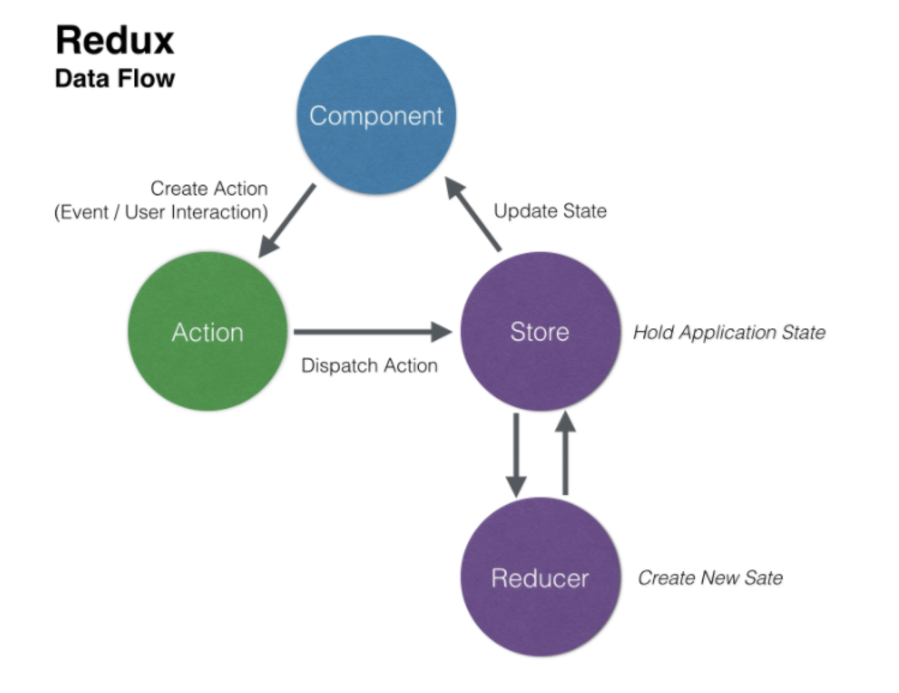

# Redux101

> Learn vanilla redux and react-redux

## Vanilla Redux

### Counter

> Make vinilla redux counter : If you look source code, change branch `vanilla-redux-counter`

> I learned big picture of redux and data flow of redux from counter example.

 

`Basic Summary of Redux:`

To use redux, we need to create `store` where I put data(In fact, data that change in app is data)

> Store has four methods, `dispatch() / getState() / replaceReducer() / subscribe()`. To use redux, I need that methods. Check it out.

Once, make store, store requires `reducer`.

`const store = createStore(reducer)`

> What is reducer?

`const reducer = (state, action) => { }`

Reducer is a `FUNCTION` that modifies my data. And if reducer return <u>something</u>, something becomes <u>data in my app</u>. Only reducer can change data. Reducer has two parameters, `state and action`

> What is action?

Action is `OBJECT`. I can use dispatch method with action as parameter to call reducer. Action is a way to communicate reducer. In fact, **I can pass the action using dispatch method to communicate reducer.**

`store.dispatch(action object)`

action object has `type` property. And accroding type property I can make logic of changing state .

It is flow:

**call dispatch(action) => call reducer => find correct logic of action type => state change**

> How to rerender according to changing state

To do this, I can use subscribe method in store. **Subscribe method allow for me to know current state in store.** If state change, store call subscribe and parameter's function.

`store.subscribe(function)`

 

> Summarized Diagram [[Reference]](https://medium.com/@aurelie.lebec/redux-and-react-native-simple-login-example-flow-c4874cf91dde)

### TodoApp

> Make vinilla redux todoapp : If you look source code, change branch `vanilla-redux-todoapp`

> I learned three principle of redux. Especially, I understanded how to change state in redux.

 

`Three Principle in Redux`

> [Three Principles](https://redux.js.org/understanding/thinking-in-redux/three-principles#three-principles)

-   `Single source` of truth

-   State is `read-only`

    > The only way to change state is to dispatch action object to reducer.

-   Changes are made with `pure functions`

    > What is pure functions

    **Pure function always returns same result(same output), whenever given same argument(same input).**

    And **function can not effect function's outside environment and can not change given argument directly**. If I wanna change input state, just produce new one.(Can not mutate)

    <u>Reducer is pure function. So, it can not mutate state directly, just should return new state.</u>
