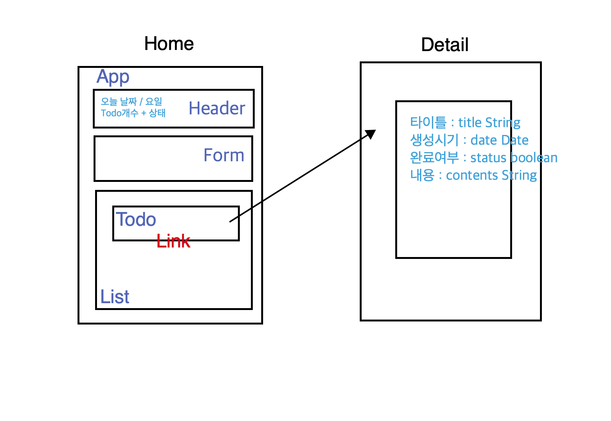

# Redux101

> Learn vanilla redux and react-redux

> 리덕스에 대한 개념을 (부족한 😅) 영어로 정리해보고자 하였다. 중간 중간에 필요한 부분은 한글을 추가하였다.

## Vanilla Redux

### Counter


> Make vanilla redux counter : If you want to see the code, change branch `vanilla-redux-counter`

> I learned big picture of redux and data flow of redux from counter example.

<br />

#### Basic Summary of Redux

> 리덕스에서 반드시 알아야 할 세가지는 **저장소(store), 리듀서(reducer), 액션(action)** 이다.

<br />

```js
import { createStore } from 'redux';

const reducer = (previousState, action) => newState;
const store = createStore(reducer);
```

What is store?

To use redux, we need to create `store` where I put data(In fact, data that change in app is data)

Store has four methods, `getState() / dispatch() / subscribe() / replaceReducer() /`.
To make store, store requires `reducer`.

> 저장소는 앱의 상태를 저장하는 공간이다. 리덕스 앱에서는 단 한개의 저장소만을 가질 수 있다. 이 저장소는 4가지의 메소드를 가지고 있다. (그 중 여기선 3가지만을 공부할 예정이다.)

> 4가지 메소드는 앞으로 개념을 이해하다보면 자연스럽게 알게 될 것이다. 그럼에도 간단하게 설명해보면, `getState()`는 저장소에서 현재 앱의 상태를 가져올 수 있다. `dispatch(action)`는 앱에서 상태 변경에 대한 메세지(액션)를 저장소에 보낼 때 사용한다. `subscribe(listener)`는 리스너을 통해서 앱을 등록하여 상태 변경을 감지하여 리랜더링이 되도록 한다.

> 저장소를 만들기 위해선(생성하기 위해선) 리덕스의 `createStore`의 (첫번째) 인자로서 리듀서가 필요하다.

<br />

What is reducer?

Reducer is a `FUNCTION` that modifies my data. And if reducer return <u>something</u>, something becomes <u>data in my app</u>. Only reducer can change data. Reducer has two parameters, `state and action`

> 리듀서는 이전 상태(state)와 액션(저장소에 보내는 상태를 어떻게 변경하라고 보내는 표시)을 받아서 다음 상태를 반환하는 `순수함수`이다.

> 순수함수 : 동일한 인자를 주었을 때, 항상 동일한 값을 반환하는 함수로서 외부 상태를 변경하지 않는다.(부수효과(side effect)가 없다)

<br />

```js
store.dispatch(action object);
```

What is action?

Action is `OBJECT`. I can use dispatch method with action as parameter to call reducer. Action is a way to communicate reducer. In fact, **I can pass the action using dispatch method to communicate reducer.**

action object has `type` property. And accroding type property I can make logic of changing state .

> 액션은 단순한 자바스크립트 객체이다. 이 객체는 앱의 상태를 나타내는 `type` 이라는 속성 갖고 있다.(그 외에도 추가할 수 있다.) 이러한 액션은 `dispatch`를 통해서 `reducer`에게 보내진다. 즉 액션은 상태에 대한 정보를 가진 객체이다.

> 액션생성자(action creator)는 단지 액션을 반환하는 함수이다. 이것이 필요한 이유는 코드를 좀 더 유연하고 재사용가능하게 해주며 테스트 하기 쉽게 만들수 있게 해주기 때문이다.

<br />

```js
store.subscribe(listener);
```

How to rerender according to changing state

To do this, I can use subscribe method in store. **Subscribe method allow for me to know current state in store.** If state change, store call subscribe and parameter's function.

> 리듀서에 의해서 앱의 새로운 상태가 반환된다. 그러면 저장소는 `subscribe`에 의헤서 리스너로 등록된 앱(컴퍼넌트)을 호출한다.

<br />

Redux flow

Step1 : App is changing and create **action** present new app state.

Step2 : Call **dispatch** and **pass action to reducer**

Step3 : Call **reducer**

Step4 : Find correct logic of **action type** in reducer function and return **new state**

Step5 : There is new state in store. Call **listener** subscribed and they can update their state.

<br />

> Summarized Diagram [[Reference]](https://medium.com/@aurelie.lebec/redux-and-react-native-simple-login-example-flow-c4874cf91dde)


<br />
<br />

### TodoApp


> Make vinilla redux todoapp : If you want to see the code, change branch `vanilla-redux-todoapp`

> I learned three principle of redux. Especially, I understanded how to change state in redux.

<br />

Three Principle in Redux

> [Three Principles](https://redux.js.org/understanding/thinking-in-redux/three-principles#three-principles)

- `Single source` of truth

- State is `read-only`

  > The only way to change state is to dispatch action object to reducer.

- Changes are made with `pure functions`

  > What is pure functions

  **Pure function always returns same result(same output), whenever given same argument(same input).**

  And **function can not effect function's outside environment and can not change given argument directly**. If I want to change input state, just produce new one.(Can not mutate)

  <u>Reducer is pure function. So, it can not mutate state directly, just should return new state.</u>

<br />
<br />

## React Redux

### TodoApp

> Make react redux todoapp : If you want to see the code, change branch `react-redux-todoapp`


> 최종적으로 실제로 만들어지 TodoApp의 모습이다.



> This is blueprint of react redux todoapp

<br />

How to use react redux

<br />
<br />

### Additional things to do

- [ ] Todo의 업데이트 기능 구현하기

- [ ] 리덕스 구조 변경하기

- [ ] 리액트 리덕스 환경에서 정보를 저장하는 방법에 대해서 알아보고 이를 추가해보자
